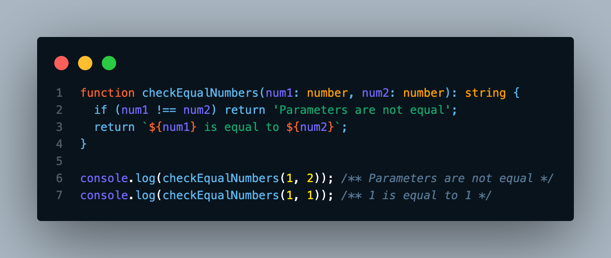
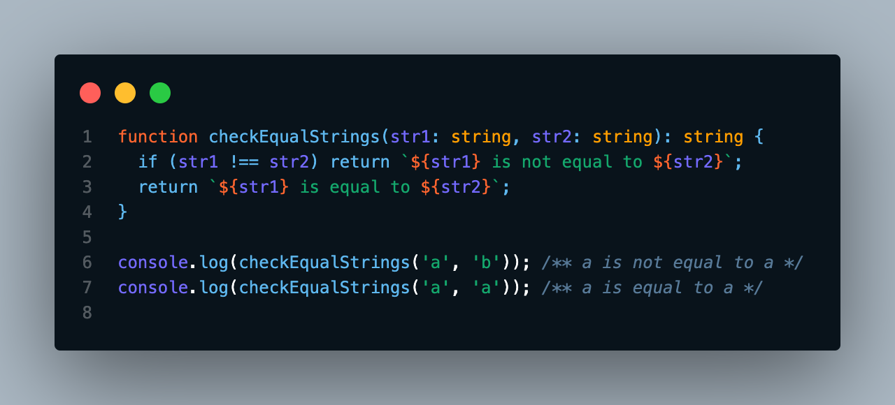
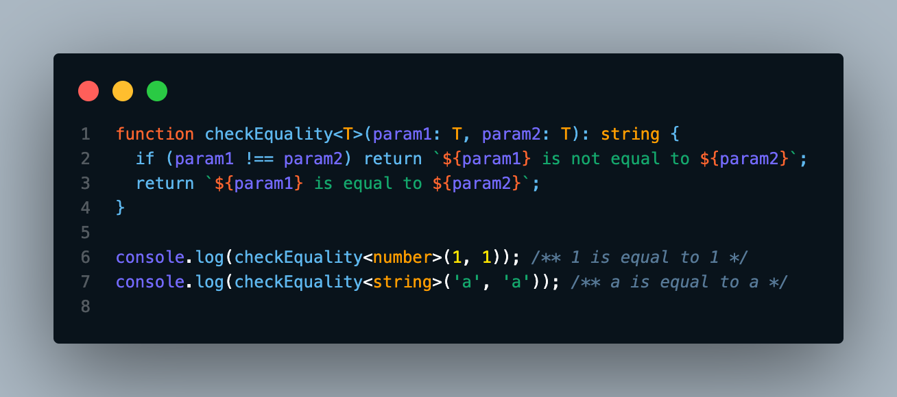

# Generics em TypeScript - Aplicações práticas

Esse conteúdo foi criado para a segunda etapa do processo seletivo de Summer Job de Currículo na [Trybe](https://www.betrybe.com/).

<br>

# O que vamos aprender? 

Hoje iremos aprender sobre **Generics**, uma funcionalidade fundamental do **TypeScript** e também de outras linguagens fortemente tipadas como **C#** e **Java**. Você verá como ele funciona na prática, e esse conhecimento será essencial para tornar seu código mais *flexível* e *reutilizável*. Vamos lá? 🚀

<br>

# Você será capaz de:

* Compreender o que são **Generics**
* Utilizar Generics em funções
* Utilizar Generics em interfaces
* Utilizar Generics em classes
* Criar funções que recebam múltiplos parâmetros genéricos

<br>

# Por que isso é importante?

Sabemos que o **TypeScript** veio para solucionar problemas que o **JavaScript** por si só não consegue, sendo o principal deles, a tipagem de elementos. Saber os tipos das variáveis com que estamos trabalhando é um passo essencial para tornarmos nosso código mais robusto, confiável e menos propenso a erros.

Porém, em alguns casos, a tipagem pode ser trabalhosa. Não seria legal ter que criar uma função para trabalhar com cada tipo primitivo, concorda? Por isso devemos buscar práticas que deixem nosso código mais dinâmico e reutilizável.

Os **Generics** são uma funcionalidade que nos permite unir esses conceitos, de forma a criar funções, classes e interfaces que possam receber um ou mais parâmetros de tipos distintos.

Quer ver como funciona? Então bora pro código! 🤓 💻

<br>

# Conteúdos

## O que são Generics?

<br>

Para começar, vamos a um exemplo prático. Suponha que você quer criar uma função que verifique se dois números são iguais. Uma das soluções possíveis seria mais ou menos assim:

<br>

<!-- ```typescript
function checkEqualNumbers(num1: number, num2: number): string {
  if (num1 !== num2) return `${num1} is not equal to ${num2}`;
  return `${num1} is equal to ${num2}`;
}

console.log(checkEqualNumbers(1, 2)); /** 1 is not equal to 2 */
console.log(checkEqualNumbers(1, 1)); /** 1 is equal to 1 */
``` -->



<br>

Agora, imagine que você precise criar uma função que verifique se duas strings são iguais. Isso poderia ser feito assim:

<br>

<!-- ```typescript
function checkEqualStrings(str1: string, str2: string): string {
  if (str1 !== str2) return `${str1} is not equal to ${str2}`;
  return `${str1} is equal to ${str2}`;
}

console.log(checkEqualStrings('a', 'b')); /** a is not equal to b */
console.log(checkEqualStrings('a', 'a')); /** a is equal to a */
``` -->



<br>

Você já deve ter reparado que estamos repetindo código, não é mesmo? Então, como faríamos para construir uma função que aceite receber parâmetros de diferentes tipos e verificar se eles são iguais?

É aqui que entram os `Generics`, veja como ficaria a nossa função de verificação genérica:

<br>

<!-- ```typescript
function checkEquality<T>(param1: T, param2: T): string {
  if (param1 !== param2) return `${param1} is not equal to ${param2}`;
  return `${param1} is equal to ${param2}`;
}

console.log(checkEquality<number>(1, 1)); /** 1 is equal to 1 */
console.log(checkEquality<string>('a', 'a')); /** a is equal to a */
console.log(checkEquality<boolean>(true, false)); /** true is not equal to false */
``` -->



Dessa forma podemos receber parâmetros de diversos tipos sem que a função apresente nenhum erro e continue nos trazendo o retorno esperado. Legal, não é mesmo?

<br>

> 💡 Definição: `Generics` é uma das principais ferramentas para criar componentes que possam trabalhar com uma variedade de tipos ao invés de somente um, e que não precisem declarar explicitamente o tipo de variável que será recebida por parâmetro. Eles nos ajudam a tornar nosso código mais reutilizável e escalável!

<br>

## Utilizando Generics em funções

<br>

A sintaxe dos `Generics` pode parecer confusa no começo, mas com o tempo você irá se acostumar, veja um exemplo de uma função que remove o segundo elemento de um array:

```typescript
function removeSecondElement<T>(array: T[]) {
  return array.filter((_element, index) => index !== 1);
}

console.log(removeSecondElement<number>([1, 2, 2, 3]));
/** imprime [1, 2, 3] */

console.log(removeSecondElement<string>(['a', 'b', 'b', 'c']));
/** imprime ['a', 'b', 'c'] */

console.log(removeSecondElement<boolean>([true, false]));
/** imprime [true] */
```

<br>

Aqui estamos definindo que a função *removeSecondElement* recebe por parâmetro um array de tipos genéricos com a sintaxe `<T>(array: T[])`, onde `T` pode ser qualquer tipo passado na hora que a função é chamada.

<br>

Vejamos agora uma função que recebe mais de um parâmetro genérico e verifica se eles pertencem ao mesmo tipo primitivo:

```typescript
function compareTypes<T, U>(param1: T, param2: U): boolean {
  return typeof param1 === typeof param2
}

console.log(compareTypes<number, string>(1, 'a'));
/** imprime false */

console.log(compareTypes<boolean, boolean>(true, false));
/** imprime true */
```

<br>

<details>
  <summary>Fixação 1</summary>

  <br>

  ### Escreva uma função chamada *mergeObjects* que deve receber dois objetos de tipos genéricos e retornar a junção deles.

  - Dica: lembre-se da funcionalidade `Object.assign`
</details>

<br>

## Utilizando Generics em interfaces

<br>

Vimos que `interfaces` são moldes criados para que nossas classes se encaixem, elas definem o formato, os nomes e os tipos dos atributos que queremos utilizar.

Como nem sempre sabemos o tipo exato do atributo que será passado, utilizar os `Generics` é a forma mais fácil de definir um atributo que terá seu tipo definido somente durante a construção de um objeto, vejamos um exemplo:

```typescript
interface IProfile<T> {
  name: string
  age: number
  data: T[]
}
```
<br>

Dessa forma, o atributo `data` receberá um array de qualquer tipo que seja passado quando um objeto que implemente essa interface for criado.

<br>

<details>
  <summary>Fixação 2</summary>

  <br>

  ### Escreva uma interface chamada *IPerson* com três atributos:
  1. `name` que deve ser do tipo string
  2. `id` que deve ser de um tipo genérico que extenda os tipos string e number
  3. `compareId` que recebe um parâmetro do mesmo tipo passado ao atributo `id` e retorna um booleano

  ⚠️ Essa interface será usada no próximo exercício de fixação. Certifique-se de realizar esse exercício antes de prosseguir.
</details>

<br>

## Utilizando Generics em classes

<br>

`Classes` são abstrações de características e ações comuns a objetos, mas como essas características podem existir e se expressar de formas diferentes, usar `Generics` com `classes` pode ser uma vantagem. A sintaxe para criar `classes` genéricas é bem parecida com a de `interfaces`, veja:

```typescript
class KeyValuePair<K = string, V = number> {
  private key: K;
  private value: V;

  constructor(
    key: K,
    value: V,
  ) {
    this.key = key;
    this.value = value;
  }

  public setKeyValue(key: K, value: V) {
    this.key = key;
    this.value = value;
  }

  public getKey() { return this.key; }

  public getValue() { return this.value; }
}

const instance1 = new KeyValuePair('id', 2);
instance1.setKeyValue('ID', 22);

console.log(instance1.getKey());
/** imprime 'ID' */

const instance2 = new KeyValuePair(2, 'value');
instance2.setKeyValue('value', 2); /** gera erro */
```
<br>

Aqui estamos criando uma classe chamada `KeyValuePair` que recebe em seu construtor os parâmetros `key` e `value`, de tipos genéricos. Além disso possui os métodos *getKey* e *getValue* para recupera os valores privados, e o método *setKeyValue*, que altera ambos os valores de uma vez.

Nesse exemplo podemos ver que, ao tentar chamar o método *setKeyValue* da instância `instance2`, o *TypeScript* gera um erro dizendo que o tipo `string` não pode ser assinalado ao tipo `number`.

Isso acontece porque quando criamos a instância `instance2`, definimos que o tipo do primeiro parâmetro é `number` e o tipo do segundo parâmetro é `string`. Uma vez definidos os tipos, não podemos mais alterá-los.

Esse comportamento do *TypeScript* nos ajuda a manter a coesão no nosso código e evita diversos outros erros.

<br>

<details>
  <summary>Fixação 3</summary>

  <br>

  ### Crie uma classe chamada *Person* que implemente a interface *IPerson* criada no exercício de fixação anterior, ela deve possuir as seguintes características:
  1. um atributo `name` que deve ser do tipo string
  2. `id` que deve ser de um tipo genérico que extenda os tipos string e number
  3. `compareId` que recebe um parâmetro do mesmo tipo passado ao atributo `id` e retorna um booleano

  ⚠️ Essa interface será usada no próximo exercício de fixação. Certifique-se de realizar esse exercício antes de prosseguir.
</details>

<br>

# Vamos praticar!

<details>
  <summary>Exercício 1</summary>
</details>

<details>
  <summary>Exercício 2</summary>
</details>

<details>
  <summary>Exercício 3</summary>

  ### Recrie a função find do JavaScript.
</details>

<details>
  <summary>Exercício 4</summary>

  ### Crie uma interface IPokemon com as seguintes características:

</details>

<br>

# Exercícios bônus

<details>
  <summary>Exercício 5</summary>

  ### Crie uma classe Pokemon que implemente a interface IPokemon.

</details>

<details>
  <summary>Exercício 6</summary>

  ### Recrie a função map do JavaScript.
</details>

<details>
  <summary>Exercício 7</summary>

  ### Recrie a função reduce do JavaScript.
</details>

<br>

# Recursos adicionais

- [Generics - Documentação do TypeScript](https://www.typescriptlang.org/docs/handbook/2/generics.html)
- [TypeScript Basic Generics - W3Schools](https://www.w3schools.com/typescript/typescript_basic_generics.php)
- [Typescript Generics - O que é, porque existe e como utilizar](https://dev.to/magoacademico/typescript-generics-59h6)
- [Introdução aos Genéricos - Microsoft](https://learn.microsoft.com/pt-br/training/modules/typescript-generics/2-what-are-generics)
- [Why you should consider using TypeScript Generics instead of Any](https://ndcunningham.medium.com/why-you-should-consider-using-typescript-generics-instead-of-any-4c6543ba88ec)

<br>

# Gabaritos

<details>
  <summary>Fixação 1</summary>

  <br>

  ### Escreva uma função chamada *mergeObjects* que deve receber dois objetos de tipos genéricos e retornar a junção deles.

  - Dica: lembre-se da funcionalidade `Object.assign`

  Solução:

  ```typescript
  function mergeObjects<T, U>(obj1: T, obj2: U): T & U {
    return Object.assign({}, obj1, obj2);
  }
  ```
</details>

<details>
  <summary>Fixação 2</summary>

  <br>

  ### Escreva uma interface chamada *IPerson* com três atributos:
  1. `name` que deve ser do tipo string
  2. `id` que deve ser de um tipo genérico que extenda os tipos string e number
  3. `compareId` que recebe um parâmetro do mesmo tipo passado ao atributo `id` e retorna um booleano

  Solução:

  ```typescript
  interface IPerson<T extends string | number> {
    name: string
    id: T
    compareId(id: T): boolean
  }
  ```
</details>

<details>
  <summary>Fixação 3</summary>
</details>

<details>
  <summary>Exercício 1</summary>
</details>

<details>
  <summary>Exercício 2</summary>
</details>

<details>
  <summary>Exercício 3</summary>
</details>

<details>
  <summary>Exercício 4</summary>
</details>

<details>
  <summary>Exercício 5</summary>
</details>

<details>
  <summary>Exercício 6</summary>
</details>

<details>
  <summary>Exercício 7</summary>
</details>
